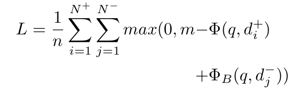

# Bias-aware Fair Neural Ranking for AddressingStereotypical Gender Biases
This repository contains the code and resources for the paper "Bias-aware Fair Neural Ranking for Addressing Stereotypical Gender Biases".
The objective of this work is to show
that it is possible to maintain competitive retrieval effectiveness
while reducing gender biases.
To this end,
we propose a bias-aware training loss function for neural ranking
methods that explicitly considers the degree of measurable gender
biases associated with negatively sampled documents. We penalize the biased irrelevant documents as 
follows:

where <math> &Phi; </math> is the scoring function and  <math> &Psi;(dj-)</math> measures the gender bias of <math> dj-</math>. We propose
that including a bias term associated with negative samples in the loss
function can ensure that the model learns to avoid representations
that are affiliated with gender biases and at the same time it learns
accurate relevance relationships based on positive instances. In
other words, the model will learn to avoid biased representations
through the bias term associated with negative samples and will also
learn relevance through the associations learnt based on the positive
documents. Therefore, such a loss function strives to maintain its
retrieval effectiveness while reducing gender bias. The proposed loss function is defined as 
follows:

[//]: 

[//]:

We evaluate our approach with the SOTA model, namely ADVBERT in terms of performance (MRR) in Figure 1. In addition, we compare the bias reduction by measuring the geneder bias in the retrieved lists
of queries for our bias-aware expansion method against ADVBERT in Table 1. We report our findings in Tables 2 and 3 for the two different query sets, respectively.  Associated run files
for each of the methods can be found
in [Results/Runs](Results/Runs) 
directory.

Figure1. Our approach versus AdvBert based on BERT-mini and BERT-tiny.

Table1. Comparison of our approach w/ ADVBERT based on BERT Tiny and Mini.

Table2. Retrieval Effectiveness & Degree of Bias based on the 215 query dataset.

Table3. Retrieval Effectiveness & Degree of Bias based on the 1,765 query dataset.

## Usage

#### In order to obtain a less biased neural ranker on the proposed bias-aware loss function, one should replicate the following steps:

##### Creating the Dataset
1. use `ARaB/documents_calculate_bias.py` script to calculate the bias level of the documents of the given collection.

2. Creat a new training set which contains the amount of boolean ARaB for each document. 
   The new training set can be formed by adding the boolean ARaB measure of each document as the 
   final column of the original MSMARCO training set. Format of the new training set will be:
   
`<query, doc_positive_doc_negative, bias_doc_negative>`

##### Training the model
###### for training the models, we have employed the OpenMatch implemantation of the bert-based neural rankers (forked into [this repository](https://github.com/biasaware1/OpenMatch))

3. Run [train_bias_aware.py](https://github.com/biasaware1/OpenMatch/blob/master/train_bias_aware.py) to train the model.
The command should be as follows:

`python train_bias_aware.py -model bert -train 
./data/bias_dataset.tsv -dev ./data/dev.jsonl -save 
./checkpoints/bert-tiny_bias-aware.bin
-qrels ./data/qrels.dev.tsv -vocab prajjwal1/bert-mini 
-pretrain prajjwal1/bert-mini -res ./results/bert-tiny_bias-aware.trec
-metric mrr_cut_10 -batch_size 16 -max_input 12800000 -epoch 1 
-eval_every 10000 -max_doc_len 221 -max_query_len 32 -lr 3e-6 -n_warmup_steps 160000`

4. Run [inference.py](https://github.com/biasaware1/OpenMatch/blob/master/inference.py) to retrieve the relevant documents of the dev srt queries.
The command should be as follows:

`python inference.py -task ranking -model bert -max_input 60000000 -vocab prajjwal1/bert-tiny -pretrain prajjwal1/bert-tiny -checkpoint ./checkpoints/bert-tiny_bias-aware.bin -res ./results/bias_inferences/inference_bert-tiny_bias-aware.trec -max_query_len 32 -max_doc_len 221 -batch_size 256 -test queries=./data/target_queries/neutral_queries.tsv,docs=./data/collection.tsv,trec=./data/target_queries/run.neutral_queries.trec`
##### In order to evaluate the proposed bias-aware loss function and calculate the level of gender biases inside the retirieved documents of each run file:

1. Use [calculate_mrr.py](https://github.com/biasaware1/biasaware/blob/main/src/calculate_mrr.py) script to calculate the MRR of the run file.

2. You may use [runs_calculate_bias.py](https://github.com/biasaware1/biasaware/blob/main/src/ARaB/runs_calculate_bias.py) and [model_calculate_bias.py](https://github.com/biasaware1/biasaware/blob/main/src/ARaB/model_calculate_bias.py)
   scripts for calculating the TF ARab and TF Boolean metrics introduced in 
   [Do Neural Ranking Models Intensify Gender Bias?](https://github.com/navid-rekabsaz/GenderBias_IR).
    In addition, the codes for the other metric namely, 
   LIWC are included inside [LIWC](https://github.com/biasaware1/biasaware/tree/main/src/LIWC) 
   directory. The LIWC lexicon is proprietary, so it is not included in this repository.
   The lexicon data can be purchased from [liwc.net](http://liwc.wpengine.com/).

